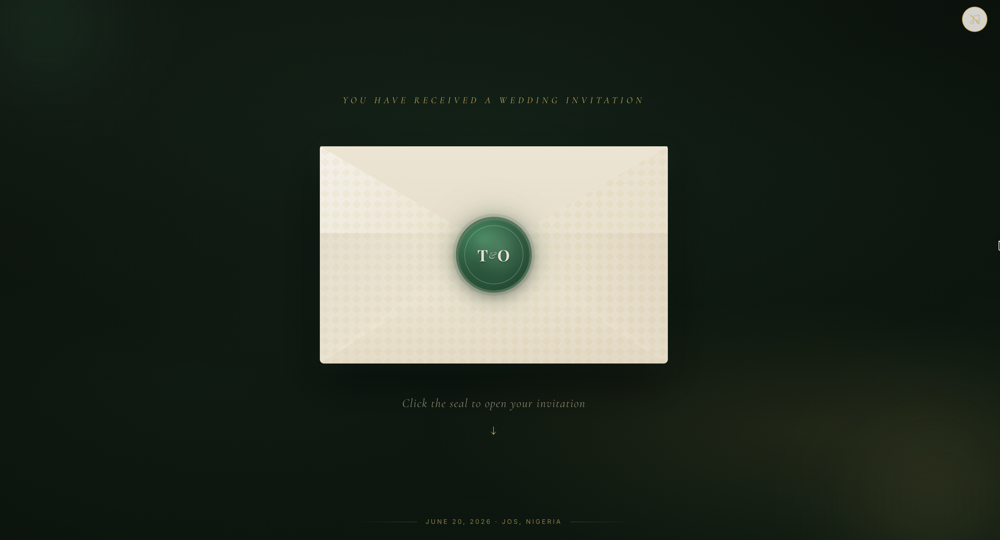
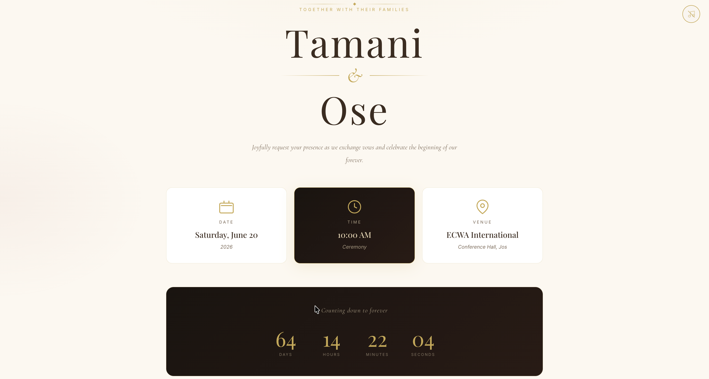

# Tamani & Ose — Digital Wedding Invitation

A fully interactive digital wedding invitation built with **Ruby on Rails 8** and **React 19**. Guests receive an animated wax-sealed envelope that they click open to reveal the full invitation — complete with a love story timeline, photo gallery, event schedule, venue map, RSVP form, and an admin dashboard.

---

## Preview

### Landing Page — Wax-Sealed Envelope


### Invitation — After the Seal is Clicked



---

## Wedding Details

| | |
|---|---|
| **Bride** | Tamani Tatiana Sale |
| **Groom** | Oisetuemeokhun Solomon Ighodalo |
| **Date** | Saturday, June 20, 2026 |
| **Time** | 10:00 AM |
| **Venue** | ECWA International Conference Hall |
| **Address** | 1 Noad Avenue, Jos, Plateau State, Nigeria |
| **Colours** | Olive Green, Emerald Green & Gold |

---

## Features

- **Animated wax-seal envelope** — emerald green T&O monogram seal with a pulsing glow; click to break the seal and open the envelope
- **Cinematic reveal** — envelope flap lifts, inner card peeks out, then transitions to the full invitation
- **Wedding details** — date, time, and venue cards with a live countdown timer
- **Love story timeline** — alternating milestone layout with photos
- **Photo gallery** — 8-photo grid with lightbox viewer
- **Event schedule** — ceremony timeline with icons
- **Interactive venue map** — OpenStreetMap embed pinned to ECWA Conference Hall, Jos
- **RSVP form** — collects name, email, attendance, guest count, and a personal note; stores to SQLite database
- **Music player** — background music toggle (add your MP3 to `public/audio/beautiful-things.mp3`)
- **Guest personalisation** — append `?guest=Name` to the URL to greet guests by name
- **Floating petals** — ambient background animation
- **Admin dashboard** — password-protected RSVP tracker at `/admin`
- **Fully responsive** — mobile, tablet, and desktop layouts

---

## Tech Stack

| Layer | Technology |
|---|---|
| Backend | Ruby on Rails 8.0.5 (API + SPA host) |
| Frontend | React 19, Framer Motion 12 |
| Styling | Tailwind CSS v4 |
| Build | esbuild (jsbundling-rails) |
| Database | SQLite (via solid_cache / queue / cable) |
| Maps | OpenStreetMap (no API key required) |

---

## Getting Started

### Prerequisites

Ensure the following are installed:

```bash
ruby -v      # 3.2.4
node -v      # 18+
yarn -v      # 1.22+
```

### First-Time Setup

```bash
# 1. Clone the Repository
cd ~/clonedrepo

# 2. Install Ruby gems (locally due to RVM permissions)
bundle config set --local path vendor/bundle
bundle install

# 3. Install JavaScript dependencies
yarn install

# 4. Set up the database
bundle exec rails db:create db:migrate
```

### Running Locally

You need **three terminals** running simultaneously:

**Terminal 1 — Rails server**
```bash
bundle exec rails server -p 3000
```

**Terminal 2 — JavaScript watcher**
```bash
yarn build --watch
```

**Terminal 3 — CSS watcher**
```bash
yarn build:css --watch
```

Then open your browser at:

```
http://localhost:3000
```

---

## Key URLs

| Page | URL |
|---|---|
| Wedding invitation | `http://localhost:3000` |
| Personalised invite | `http://localhost:3000?guest=GuestName` |
| Admin dashboard | `http://localhost:3000/admin` |

---

## Project Structure

```
app/
├── javascript/
│   ├── application.jsx              # Entry point + admin routing
│   └── components/
│       ├── App.jsx                  # Main app shell
│       ├── EnvelopeLanding.jsx      # Wax seal + envelope animation
│       ├── WeddingDetails.jsx       # Names, date, time, venue, countdown
│       ├── LoveStory.jsx            # Timeline milestones
│       ├── PhotoGallery.jsx         # Photo gri
│       ├── EventSchedule.jsx        # Day-of schedule
│       ├── RSVPSection.jsx          # RSVP form
│       ├── LocationMap.jsx          # Venue map + footer
│       ├── AdminDashboard.jsx       # Admin RSVP tracker
│       ├── FloatingPetals.jsx       # Ambient petal animation
│       └── MusicToggle.jsx          # Background music player
├── assets/stylesheets/
│   └── application.tailwind.css     # All styles + responsive breakpoints
└── controllers/api/
    └── rsvps_controller.rb          # POST /api/rsvps · GET /api/rsvps
```

---

*Designed with love by Tolu ♥*
